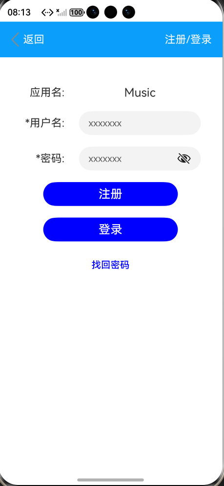

参考鸿蒙“基于AppAccountManager能力实现应用账号管理”项目，目标：学习了解项目的工程架构、借助AI智能体进行功能拓展。
 升级内容：
本项目实现的找回密码功能，在模拟器环境下重点验证了UI交互流程与页面路由跳转。受限于模拟器缺少蜂窝网络硬件及SIM卡，验证码的真实发送需在真机环境进一步验证。

 工程框架：
app-account-manager-master/
├── entry/                          # 主模块（入口模块）
│   ├── src/main/
│   │   ├── ets/                    # ArkTS 代码区
│   │   │   ├── common/             # 公共组件
│   │   │   │   ├── AccountInfo.ets     # 账号信息组件
│   │   │   │   ├── BundleInfo.ets      # 应用列表组件（音乐/视频/地图）
│   │   │   │   ├── FindPasswordInfo.ets     # 找回密码表单组件
│   │   │   │   ├── LoginInfo.ets       # 登录表单组件
│   │   │   │   ├── ModifyInfo.ets      # 修改信息组件
│   │   │   │   ├── NavigationBar.ets   # 导航栏组件
│   │   │   │   └── RegisterInfo.ets    # 注册表单组件
│   │   │   ├── entryability/
│   │   │   │   └── EntryAbility.ets    # 应用入口能力
│   │   │   ├── model/              # 数据模型层
│   │   │   │   ├──AccountData.ets     # 数据存储管理
│   │   │   │   ├──AccountModel.ets    # 账号业务逻辑
│   │   │   │   └── Logger.ets          # 日志工具
│   │   │   └── pages/              # 页面
│   │   │       ├── Account.ets         # 账号详情页
│   │   │       ├── FindPassword.ets      # 找回密码页
│   │   │       ├── Index.ets           # 首页（应用选择）
│   │   │       ├── Login.ets           # 登录页
│   │   │       ├── Register.ets        # 注册页
│   │   │       └── Modify.ets          # 修改信息页
│   │   └── resources/              # 资源文件
│   │       ├── base/               # 基础资源
│   │       ├── en/                 # 英文资源
│   │       └── zh/                 # 中文资源
│   ├── build/                      # 编译输出目录
│   ├── build-profile.json5       # 项目构建配置
│   ├── hvigorfile.ts          # 模块级构建脚本
│   └── oh-package.json5      # 项目依赖配置
├── AppScope/                       # 应用全局资源
├── hvigor/                         # Hvigor 构建工具
├── .hvigor/                        # Hvigor 缓存
├── .idea/                          # IDE 配置
├── screenshots/                    # 截图资源
├── build-profile.json5             # 项目构建配置
├── oh-package.json5                # 项目依赖配置
└── README.md                       # 项目说明文档
